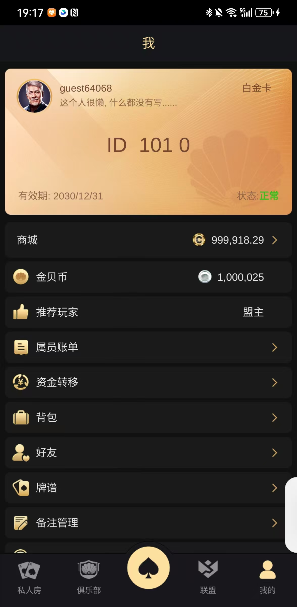

# 🃏|德州源码|德州游戏源码|德州联盟源码| 德州朋友局源码  | 德州扑克私人俱乐部源码 | 德州撲克私人俱樂部源碼|Texas Hold'em Private Club & Private Room Source Code
🔥 Production-ready Texas Hold'em Private Club Platform ｜ 生产级私人俱乐部德州扑克平台 ｜ 生產級私人俱樂部德州撲克平台  
🔥 Real-time multiplayer & multi-device support ｜ 实时多人，多端支持 ｜ 即時多人，多端支持  
🔥 Already used in real poker projects ｜ 已应用于真实扑克项目 ｜ 已應用於真實撲克項目  
🔥 Contact now for full source code & live demo ｜ 联系获取完整源码及在线演示 ｜ 聯絡獲取完整源碼及在線演示  

**私人局 · 朋友局 · 联盟系统 · 语音聊天**

**简体中文 · 繁體中文 · English**

---

## 📖 产品简介 | 產品簡介 | Overview

| 语言 | 说明 |
|:---|:---|
| **简体中文** | 一套**专注于俱乐部/朋友局**的德州扑克完整源码。**产品精美，代码质量可靠**（成功商业化的源码，非外包项目）。包含**7-8种德州玩法**：SNG、MTT、经典德州、大菠萝、短牌等。含联盟系统、语音聊天。 |
| **繁體中文** | 一套**專注於俱樂部/朋友局**的德州撲克完整原始碼。**產品精美，程式碼品質可靠**（成功商業化的原始碼，非外包項目）。包含**7-8種德州玩法**：SNG、MTT、經典德州、大菠蘿、短牌等。含聯盟系統、語音聊天。 |
| **English** | A **club/private-room focused** Texas Hold'em complete source code. **Beautiful product, reliable code quality** (commercially successful, not outsourced). Includes **7-8 game modes**: SNG, MTT, Classic, Pineapple, Short Deck, etc. Alliance system + voice chat. |

---

## ✨ 核心功能 | Core Features

| 功能 | 说明 |
|:---|:---|
| 🏛️ **俱乐部系统** | 创建俱乐部、成员管理、俱乐部排行榜 |
| 👥 **私人朋友局** | 密码房、好友邀请、观战模式 |
| 🎙️ **语音聊天** | 内置实时语音，朋友局体验更真实 |
| 🎰 **7-8种玩法** | SNG、MTT、经典德州、大菠萝、短牌等 |
| 🏆 **联盟系统** | 多俱乐部联盟、联盟排行榜 |
| 💬 **聊天系统** | 完整的游戏内聊天功能 |

---

## ✨ Features | 核心功能 | 功能特色

- ✅ Full source code (Server + Client) ｜ 完整源码 ｜ 完整源碼  
- ✅ Private Club / Room system ｜ 私人俱乐部 / 房间系统 ｜ 私人俱樂部 / 房間系統  
- ✅ Real-time multiplayer (WebSocket) ｜ 实时多人 ｜ 即時對戰  
- ✅ High-performance C++ engine ｜ 高性能引擎 ｜ 高效能引擎  
- ✅ Scalable architecture ｜ 可扩展 ｜ 可擴展  
- ✅ Payment & Rake system ｜ 支付与抽水系统 ｜ 支付與抽水系統  
- ✅ Admin panel for management ｜ 后台管理 ｜ 後台管理

## 🧩 System Modules | 系统模块 | 系統模組

- 🎮 Game Engine (核心游戏逻辑 / 核心邏輯)  
- 📱 Web & Mobile Client (多端客户端)  
- 🏠 Club / Private Room System (俱乐部 / 私人房间系统)  
- 💰 Payment & Rake System (支付与抽水系统)  
- 🛠 Admin Panel (后台管理系统)  
- 📊 Statistics & Analytics (数据统计与分析)  

## 🎮 游戏玩法 | 遊戲玩法 | Game Modes

| 玩法 | 说明 |
|:---|:---|
| 🏆 **SNG** | 单桌淘汰赛，自动分配 |
| 🏅 **MTT** | 多桌锦标赛 |
| ♠️ **经典德州** | 标准德州扑克规则 |
| 🍍 **大菠萝** | 13张牌摆牌玩法 |
| ♦️ **短牌** | 去掉2-5张牌，节奏更快 |

## 💰 Monetization Model | 盈利模式 | 盈利模式

- ✔ Game rake (抽水)  
- ✔ Tournament fees (报名费)  
- ✔ Club system revenue (俱乐部收益)  
---

## 🏗️ 技术架构 | Tech Stack

| 模块 | 技术 |
|:---|:---|
| 客户端引擎 | Unity |
| 服务端语言 | C++ |
| 网络框架 | 高性能异步框架 |
| 数据库 | MySQL + Redis |
| 语音聊天 | 主流语音SDK |

---

## 📸 界面截图 | Screenshots

---

### 获取完整源码

如需获取**完整的德州扑克俱乐部源码 + 部署文档 + 技术支持**，请联系：

| 渠道 | 账号 |
|:---|:---|
| **Telegram** | @alibabama401 |
| **Email** | ttpoker733@gmail.com |

---

## ❓ 常见问题 | FAQ

**Q1：这套源码和网上其他源码有什么区别？**  
A：这是成功商业化的源码，不是外包团队做的项目，代码质量更可靠。

**Q2：包含哪些玩法？**  
A：包含SNG、MTT、经典德州、大菠萝、短牌等7-8种玩法。

**Q3：有语音聊天吗？**  
A：有。内置实时语音聊天功能。

**Q4：可以二次开发吗？**  
A：可以。源码支持功能扩展和 UI 定制。

**Q5：提供部署服务吗？**  
A：提供。购买后可远程协助部署。

---
## 💬 Contact | 联系方式 | 聯絡方式

📧 Email: ttpoker40@gmail.com  
💬 Telegram: @alibabama401  
## 🔍 Keywords (SEO) | 关键词 | 關鍵字

Texas Hold'em private club source code, poker private room platform, online poker software, casino game system, poker engine, multiplayer poker server,  
德州扑克私人俱乐部源码, 私人房间德州扑克, 多人德州扑克, 在线德州扑克, 德州扑克完整源码

**如果这个项目对你有帮助，欢迎点个 Star 支持一下！**  
⭐️ **Star** ⭐️

